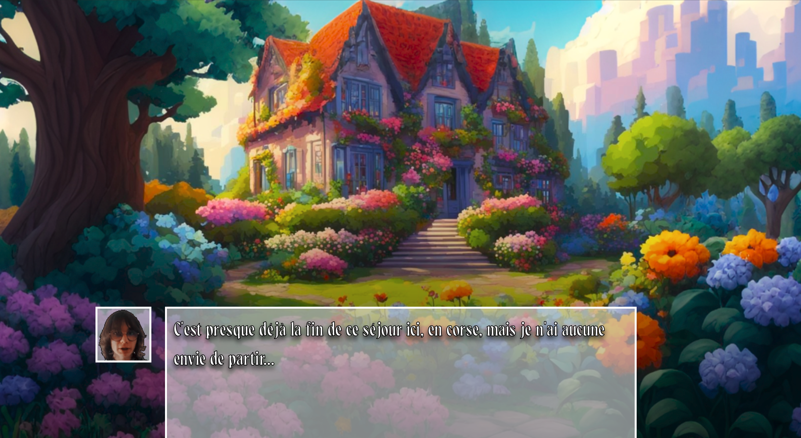
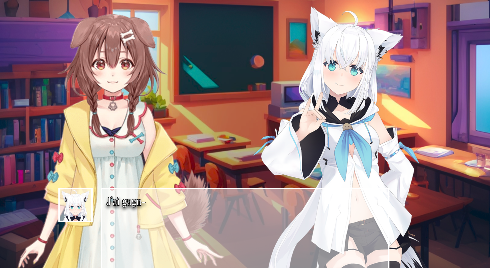
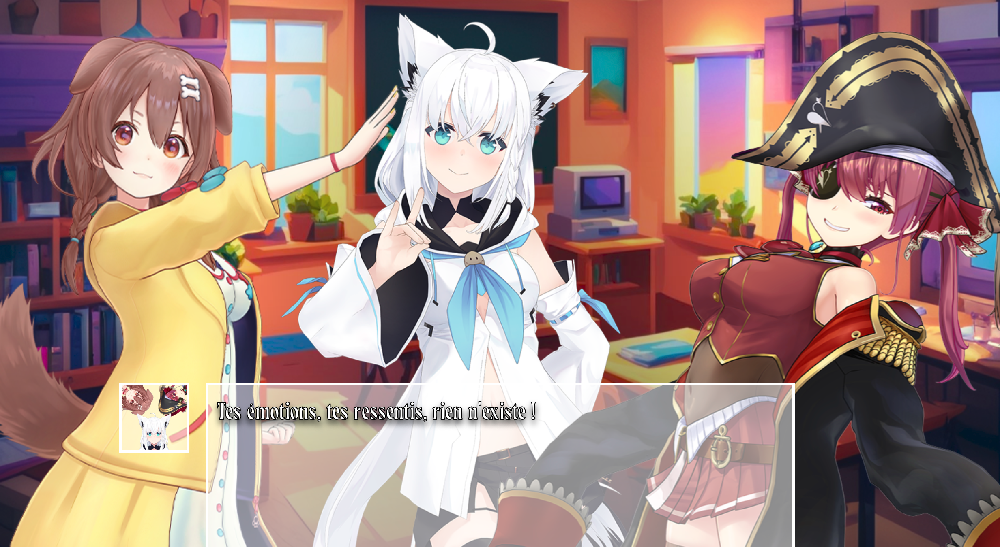

# The Anecdote - Visual Novel Engine

> Drop your assets and a JSON file. The engine handles the rest.

**Multi-character scenes · Emotion system · Auto-transitions · Typewriter animation**  
<<<<<<< HEAD
Built entirely in vanilla HTML/CSS/JS - no framework, no game engine.
=======
Built entirely in vanilla HTML/CSS/JS — no framework, no game engine.
>>>>>>> 18bb63a8d4dbb8019cb99b1bcb7d8805b00ab7e3

*Built in late 2024.*

---

## Screenshots

| Opening scene | Dramatic cut |
|---|---|
|  |  |

| 2-character scene | 3-character scene |
|---|---|
|  |  |

---

## How it works

<<<<<<< HEAD
IMPORTANT : THE JSON FILE MUST BE ENCODED IN BASE64 BEFOREWARDS

The engine reads a single JSON file encoded in base64 and plays the story automatically.  
No code to write - just provide your assets and fill the JSON.
=======
The engine reads a single JSON file and plays the story automatically.  
No code to write — just provide your assets and fill the JSON.
>>>>>>> 18bb63a8d4dbb8019cb99b1bcb7d8805b00ab7e3

Each dialogue entry defines everything for that scene:

```
Key:   "diaBoxN-CharA_emotion-CharB_emotion"
Value: ["Background", "Soundtrack", "SpeakerIcon", "Text", "posA", "posB"]
```

**Concrete example — 3 characters on screen:**
```json
"diaBox35-KRN_neutral-FBK_neutral-MRN_neutral": [
    "SchoolClass",
    "SayFanfare8bits",
    "MRN",
    "Que-ce passe-t-il ici ?",
    "FL", "M", "FR"
]
```

→ Background switches to `SchoolClass.jpg`  
→ Soundtrack switches to `SayFanfare8bits.mp3`  
→ Marine's face icon appears in the dialogue box  
→ 3 full-body sprites placed at Far Left / Middle / Far Right  
→ Text animates letter by letter

---

## Features

- **Up to 4 simultaneous characters** — placed at FL / L / M / R / FR positions on canvas
- **Emotion variants** — each character has multiple sprite states (neutral, happy, determined...)
<<<<<<< HEAD
- **Customizable speaker** — possibility to have an unknown character, or one that represent multiple or realy anything
=======
- **Combined speaker icons** — when multiple characters speak together, their icons merge
>>>>>>> 18bb63a8d4dbb8019cb99b1bcb7d8805b00ab7e3
- **Auto-transitions** — background fades automatically on scene change, sprites update instantly
- **Typewriter animation** — text renders letter by letter, SPACE skips to next line
- **Per-scene soundtrack** — music changes automatically, no duplicate plays
- **Dialogue box toggle** — press A to hide/show the UI for screenshots
<<<<<<< HEAD
- **Base64 encoding** - the json file is read in Base64 to to prevent spoilers
 
=======
- **Base64-e# The Annecdote
 
ncoded story** — script is obfuscated to prevent spoilers
>>>>>>> 18bb63a8d4dbb8019cb99b1bcb7d8805b00ab7e3

---

## Asset structure

```
assets/
├── IMGs/
│   ├── BGs/                    # background images (.jpg)
│   └── Sprites/
│       ├── FaceICONs/          # portrait icons for the dialogue box
│       └── FullBodyChars/      # full-body sprites (CharacterName_emotion.png)
└── AUDIOs/
    ├── SoundTracks/            # looping background music (.mp3)
    └── SoundEffects/           # one-shot sound effects (.mp3)
```

<<<<<<< HEAD
To create your own story: replace the assets and rewrite `DATA/data.b64`.
=======
To create your own story: replace the assets and rewrite `DATA/data.json`.
>>>>>>> 18bb63a8d4dbb8019cb99b1bcb7d8805b00ab7e3

---

## Controls

| Action | Key |
|--------|-----|
| Start / advance | SPACE or Click |
| Toggle dialogue box | A |

---

## Showcase story — *The Anecdote*

A short original story made to demonstrate the engine — featuring a friend and Hololive vtuber characters as a fun casting choice.

> Browser version: zoom in (Ctrl +) for the best experience.  
> For the best experience, run the Electron version.

<<<<<<< HEAD
To run locally, go to /web_app(Electron) then:
=======
To run locally:
>>>>>>> 18bb63a8d4dbb8019cb99b1bcb7d8805b00ab7e3
```bash
npm install
npm start
```

<<<<<<< HEAD
*The exe file should be in /web_app(Electron)/dist/ .*

=======
>>>>>>> 18bb63a8d4dbb8019cb99b1bcb7d8805b00ab7e3
---

## Stack

`HTML` `CSS` `JavaScript` `Canvas API` — zero dependencies.  
Packaged as a desktop app with [Electron](https://www.electronjs.org/).

---

## Credits

Engine, story and integration by **SkylePaf**.  
Showcase story characters: Hololive vtubers (Fubuki, Korone, Marine) — © Cover Corp.  
Soundtracks: 8-bit arrangements of Hololive original songs — © Cover Corp.  
Backgrounds: AI-generated imagery.
